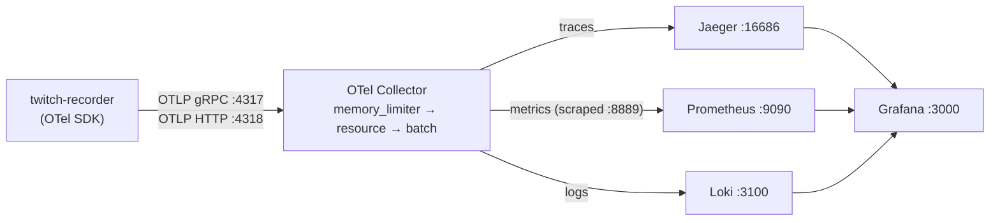

# Twitch Stream Recorder

This script allows you to record twitch streams live to .mp4 files.

## Prerequisite

- `client_id` - you can grab this from [here](https://dev.twitch.tv/console/apps) once you register your application
- `client_secret` - you generate this [here](https://dev.twitch.tv/console/apps) as well, for your registered application
- (Optional)`twitch_oauth_token` - personal OAuth token from Twitch. Check [this section](#how-to-get-twitch-oauth-token) for details.

## Bulk run using helm

```
# helm install
helm install twitch-stream-recorder ./helm --namespace twitch-stream-recorder-namespace
```

add list of channels to ./helm/values.override.yaml and upgrade

```bash
helm upgrade --install twitch-stream-recorder ./helm \
  --namespace twitch-stream-recorder \
  --values ./helm/values.yaml \
  --values ./helm/values.override.yaml
```

## Run on Docker

### Docker Compose

1. Clone the repo.
1. Simply copy .env.example to .env file
1. run `Docker compose up`

#### Single container(recommend)

Create .env file from .env.example and run

```
docker run --name twitch-stream-recorder \
    -v <your-vod-warehouse>:/app/rec:Z \
    --env-file .env \
    ghcr.io/civon/twitch-stream-recorder \
    --username myFavStreamer # You can override env by args \
    -q worst \
    --log warn
```

## Observability (OpenTelemetry)

The recorder is instrumented with the OpenTelemetry SDK for traces, metrics and
logs. Instrumentation is **entirely optional**: with no `OTEL_EXPORTER_OTLP_ENDPOINT`
set the SDK is never started and every telemetry call becomes a no-op, so the
recorder behaves exactly as it did before.

### Architecture



### What is instrumented

**Traces** — `twitch.oauth.token` (token fetch), `twitch.api.get_streams`
(stream status polling), `twitch.stream.record` (one full recording session,
parent of the wide events below) and `recording.process` (ffmpeg remux / move).
Outbound HTTP is additionally auto-instrumented through
`opentelemetry-instrumentation-requests`.

**Metrics**

| Metric | Type | Description |
| --- | --- | --- |
| `twitch.recorder.active_recordings` | UpDownCounter | Recordings currently in progress |
| `twitch.recorder.stream.uptime` | Observable gauge | Seconds since the in-flight recording started |
| `twitch.recorder.recording.duration` | Histogram | Duration of a finished recording |
| `twitch.recorder.processing.duration` | Histogram | ffmpeg post-processing duration |
| `twitch.recorder.bytes_written` | Counter | Bytes written to disk |
| `twitch.recorder.api.requests` | Counter | Twitch API calls by endpoint and status code |
| `twitch.recorder.errors` | Counter | Errors by `error.type` |

Process and runtime metrics come from `opentelemetry-instrumentation-system-metrics`.

**Logs** — the root logger gets an OTLP handler, so every existing `logging`
call is exported with the active trace and span IDs attached.

### Wide events

Each notable operation produces a single densely-attributed record rather than
several thin log lines. Wide events are emitted twice: as a span event on the
active span (visible inline in Jaeger) and as a structured log record (queryable
in Loki). Emitted events: `stream_start`, `stream_end`, `recording_complete`,
`recording_failed`, `disk_space_warning`, `api_rate_limit`, `reconnection_attempt`.

A `recording_complete` event carries, for example:

```
event.name, event.domain, event.timestamp, service.name, host.name,
twitch.streamer_name, twitch.stream_id, twitch.user_id, twitch.quality,
twitch.stream.title, twitch.stream.game_name, twitch.stream.language,
twitch.stream.viewer_count, twitch.stream.started_at,
file.path, file.name, file.size, recorder.processed_path,
recorder.duration_seconds, recorder.streamlink_exit_code,
media.duration_seconds, media.bitrate_bps, media.video_codec,
media.audio_codec, media.width, media.height, media.frame_rate
```

Adding a field means passing one more keyword argument to
`WideEventEmitter.emit()` in `wide_events.py` — attributes travel as a flat map,
so no consumer needs to change.

### Configuration

Everything is environment driven and follows the OpenTelemetry specification.

| Variable | Default | Purpose |
| --- | --- | --- |
| `OTEL_EXPORTER_OTLP_ENDPOINT` | _(empty)_ | Collector endpoint. Empty disables telemetry. |
| `OTEL_ENABLED` | auto | Force telemetry on/off regardless of the endpoint. |
| `OTEL_EXPORTER_OTLP_PROTOCOL` | `grpc` | `grpc` or `http/protobuf`. |
| `OTEL_SERVICE_NAME` | `twitch-stream-recorder` | `service.name` resource attribute. |
| `OTEL_RESOURCE_ATTRIBUTES` | _(empty)_ | Extra resource attributes, e.g. `deployment.environment=prod`. |
| `OTEL_METRIC_EXPORT_INTERVAL` | `15000` | Metric export interval in milliseconds. |
| `OTEL_LOGS_ENABLED` | `true` | Export logs over OTLP. |
| `DISK_FREE_WARNING_RATIO` | `0.10` | Free-space share that triggers `disk_space_warning`. |

### Run the stack with Docker

```bash
cp .env.sample .env      # fill in username / client_id / client_secret / archive
docker compose -f docker-compose.otel.yml config    # validate
docker compose -f docker-compose.otel.yml up --build
```

| UI | URL |
| --- | --- |
| Grafana (dashboard "Twitch Stream Recorder") | http://localhost:3000 (admin/admin) |
| Jaeger | http://localhost:16686 |
| Prometheus | http://localhost:9090 |
| Loki API | http://localhost:3100 |
| Collector health check | http://localhost:13133 |

### Deploy to Kubernetes

```bash
kubectl apply -f k8s/namespace.yaml
kubectl create secret generic twitch-recorder-credentials \
  --namespace twitch-recorder \
  --from-literal=client_id=... \
  --from-literal=client_secret=... \
  --from-literal=twitch_oauth_token=
kubectl apply -k k8s/
```

`k8s/kustomization.yaml` generates the Grafana dashboard ConfigMap from
`observability/grafana/dashboards/twitch-recorder.json`, so the dashboard is
defined once and shared by both deployment paths. Recorder settings live in the
`twitch-recorder-config` ConfigMap and credentials in the
`twitch-recorder-credentials` Secret (see `k8s/secret.example.yaml`).

Port-forward the UIs:

```bash
kubectl -n twitch-recorder port-forward svc/grafana 3000:3000
kubectl -n twitch-recorder port-forward svc/jaeger 16686:16686
kubectl -n twitch-recorder port-forward svc/prometheus 9090:9090
```

## Requirements

1. [python3.8](https://www.python.org/downloads/release/python-380/) or higher
2. [streamlink](https://streamlink.github.io/)
3. [ffmpeg](https://ffmpeg.org/)

## Setting up

1. Check if you have latest version of streamlink:

   - `streamlink --version` shows current version
   - `streamlink --version-check` shows available upgrade
   - `sudo pip install --upgrade streamlink` do upgrade

2. Install the Python dependencies: `pip install -r requirements.txt`
   (this covers `requests` plus the optional OpenTelemetry packages; the
   recorder also runs with only `requests` installed)
3. Create `config.py` file in the same directory as `twitch-recorder.py` with:

```properties
root_path = "/home/abathur/Videos/twitch"
username = "forsen"
client_id = "xxxxxxxxxxxxxxxxxxxxxxxxxxxxxx"
client_secret = "zzzzzzzzzzzzzzzzzzzzzzzzzzzzzzz"
twitch_oauth_token = "" # Optional
```

`root_path` - path to a folder where you want your VODs to be saved to  
`username` - name of the streamer you want to record by default  
`client_id` - you can grab this from [here](https://dev.twitch.tv/console/apps) once you register your application  
`client_secret` - you generate this [here](https://dev.twitch.tv/console/apps) as well, for your registered application
`twitch_oauth_token` - personal OAuth token from Twitch (Optional)

4. (Optional) Modify .streamlinkrc base on https://streamlink.github.io/cli.html

### How to get Twitch OAuth Token

Check [this document](https://streamlink.github.io/cli/plugins/twitch.html) for details.

After login Twitch on web browser, open Developer console. And paste Javascript code below to "Console" tab and press enter.

```
document.cookie.split("; ").find(item=>item.startsWith("auth-token="))?.split("=")[1]
```

## Running script

The script will be logging to a console and to a file `twitch-recorder.log`

### On linux

Run the script

```shell script
python3.8 twitch-recorder.py
```

To record a specific streamer use `-u` or `--username`

```shell script
python3.8 twitch-recorder.py --username forsen
```

To specify quality use `-q` or `--quality`

```shell script
python3.8 twitch-recorder.py --quality 720p
```

To change default logging use `-l`, `--log` or `--logging`

```shell script
python3.8 twitch-recorder.py --log warn
```

To disable ffmpeg processing (fixing errors in recorded file) use `--disable-ffmpeg`

```shell script
python3.8 twitch-recorder.py --disable-ffmpeg
```

If you want to run the script as a job in the background and be able to close the terminal:

```shell script
nohup python3.8 twitch-recorder.py >/dev/null 2>&1 &
```

In order to kill the job, you first list them all:

```shell script
jobs
```

The output should show something like this:

```shell script
[1]+  Running                 nohup python3.8 twitch-recorder > /dev/null 2>&1 &
```

And now you can just kill the job:

```shell script
kill %1
```

### On Windows

You can run the scipt from `cmd` or [terminal](https://www.microsoft.com/en-us/p/windows-terminal/9n0dx20hk701?activetab=pivot:overviewtab), by simply going to the directory where the script is located at and using command:

```shell script
python twitch-recorder.py
```

The optional parameters should work exactly the same as on Linux.

## Credits

- @junian
- @Ancalentari
- @AntonioMIN
- @jim60105
